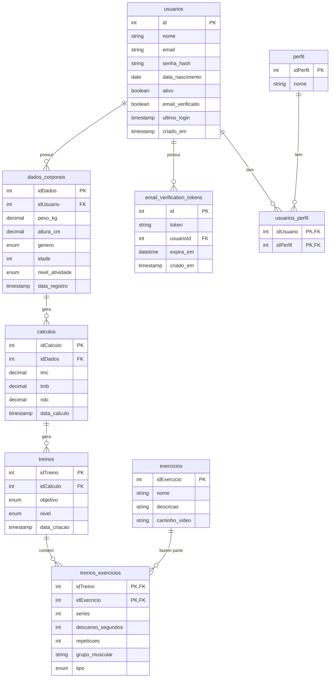

# Especificação Técnica e Arquitetura

Este documento consolida os artefatos técnicos do Sistema de Análise Corporal e Metabólica, definindo a estrutura de dados, componentes do sistema, relação de funcionalidades e os padrões visuais (Design System).

## 1. Diagrama Entidade-Relacionamento (DER)

Abaixo apresentamos o modelo conceitual e lógico de dados que sustenta o sistema.

## 2. Relacionamento: Funcionalidades, Dados e Lógica

A matriz abaixo detalha como os requisitos propostos se conectam à estrutura de banco e à lógica de programação.

| Funcionalidade | Tabelas/Entidades Envolvidas | Lógica de Negócio Envolvida |
| --- | --- | --- |
| **Cadastro e Login** | `usuarios`, `perfil`, `email_verification_tokens` | Hash de senhas (bcrypt), geração e validação de JWT, envio de e-mails para verificação de conta. |
| **Cálculo de IMC, TMB e NDC** | `dados_corporais`, `calculos` | Fórmulas matemáticas (ex: IMC = peso / altura²; TMB via equação de Harris-Benedict) multiplicadas pelo fator de atividade do usuário. |
| **Geração de Treinos Iniciais** | `treinos`, `treinos_exercicios`, `exercicios`, `calculos` | Algoritmo que lê o objetivo (hipertrofia, emagrecimento), nível e NDC do usuário e seleciona um subconjunto adequado de `exercicios` com séries/repetições predefinidas. |
| **Acompanhamento de Evolução** | `dados_corporais`, `calculos` | Consultas cronológicas (`ORDER BY data_registro DESC`) extraindo gráficos de evolução de Peso, IMC e NDC. |
| **Exibição de Exercícios** | `exercicios`, `treinos_exercicios` | Front-end renderiza a lista de exercícios do treino atual, carregando o campo `caminho_video` para um media player. |

## 3. Design System Simplificado

Este é o padrão visual fundamental utilizado na construção das interfaces Web (React/HTML/CSS) e Mobile (React Native).

### 3.1. Cores (Color Palette)

- **Primary Color:** `#FF5722` (Laranja Forte) - Utilizado para CTAs, botões principais e destaques. Traz a energia e dinâmica de exercícios físicos.
- **Secondary Color:** `#1E293B` (Azul Escuro/Slate) - Cor de fundo de cabeçalhos, barras laterais e elementos de forte contraste.
- **Background Color:** `#F8FAFC` (Cinza muito claro) - Fundo principal do app para facilitar leitura e sensação de limpeza.
- **Text Color (Principal):** `#334155` (Cinza Escuro) - Para textos de corpo e subtítulos.
- **Success Color:** `#22C55E` - Para feedbacks positivos, como "Treino Concluído" ou aumento de performance.
- **Danger/Error Color:** `#EF4444` - Para alertas ou exclusão de dados.

### 3.2. Tipografia

- **Fonte Principal (Headings e Body):** `Inter` ou `Roboto`.
- **Pesos:** 
  - Regular (400) para parágrafos.
  - Medium (500) para botões e links.
  - Bold (700) para Títulos (H1, H2, H3).

### 3.3. Componentes Visuais

- **Botões (Buttons):**
  - *Primary:* Fundo `#FF5722`, texto `#FFFFFF`, cantos arredondados (border-radius: 8px), sem borda. Hover: brilho ou leve escurecimento (`#E64A19`).
  - *Secondary:* Fundo transparente, borda de 2px sólida `#1E293B`, texto `#1E293B`.
- **Cards:**
  - Fundo `#FFFFFF`, sombra suave (box-shadow: 0 4px 6px rgba(0,0,0,0.1)), cantos arredondados (border-radius: 12px), padding interno espaçoso (16px a 24px).
- **Inputs (Formulários):**
  - Borda sólida fina (`#CBD5E1`), fundo branco, cantos arredondados (6px). Ao receber foco (focus), a borda muda para `#FF5722` e adiciona-se um leve outline.
